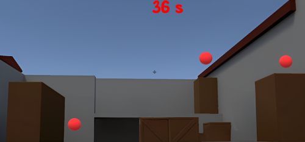
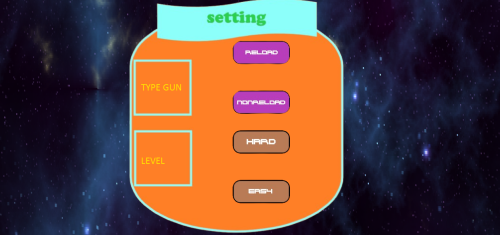
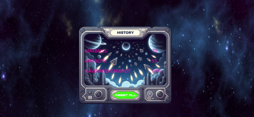

# BTL
## Giới thiệu:
- Em tên là   : Đỗ Đình Nam.
- MSSV        : 23020120.
- Bài tập lớn : AIMLAB.
## Chi Tiết Về Game:
### Chủ đề:
Chào mừng đến với AimLab - nền tảng rèn luyện kỹ năng bắn súng chuyên sâu với mục tiêu phát triển kỹ năng bắn tỉa của bạn đến mức cao nhất. AimLab không chỉ là một trò chơi, mà còn là một công cụ huấn luyện thiết yếu cho các game thủ chuyên nghiệp và người mới bắt đầu. Với sự kết hợp của các bài kiểm tra chính xác và phản hồi chi tiết, AimLab giúp bạn cải thiện độ chính xác và tốc độ phản ứng mình trong mọi trò chơi bắn súng.
### Gameplay:
 Xem thêm tại [đây](https://youtu.be/1TA9qcd_UpE)
### Control:
1. Chơi với bóng:
- Chủ yếu bằng chuột. Nhấn chuột trái để bắn.
- 
- Esc để hiển thị màn hình Pausegame.
2. Chơi với bot:
- A/D: Di chuyển sang trái/phải ( chỉ di chuyển được 1 đoạn ngắn ).
- Shift: Đi bộ.
- Ctrl : Ngồi.
- B    : Kho đồ.
- Tab  : Thay đổi thông số trạng thái game ( dễ, khó, .... ).
- Còn lại về thao tác chuột và thoát ra tương tự như chơi với bóng.
- 
- 
- Xem thêm tại *Instruction* trong game.
### Chi tiết game:
0. Game chơi góc nhìn thứ 1.
1. Chơi với bóng:
- Là chế độ đơn giản, nơi bạn tập trung tối đa vào việc tập phản xạ để bắn trúng nhiều bóng nhất trong một khoảng thời gian.
2. Chơi với bot:
- Là một chế độ khó hơn so với chơi với bóng, phù hợp để tập luyện sau khi đã bắn với bóng, nơi tái hiện một cách chân thật nhất có thể những gì liên quan đến game ( các loại súng khác nhau với thông số súng khác nhau, dame gây lên những con bot khác nhau, bot biết di chuyển,... ).
- Chia ra các trạng thái game ( nonreload / reload, dễ / khó ) tuỳ vào nhu cầu tập luyện của người chơi.
3. Tất cả kết quả tốt nhất của bạn sẽ lưu trong History, hãy coi đó là mục tiêu để vượt qua mỗi ngày !!
- 
### Một số kĩ thuật sử dụng trong game:
- **Interval tree**: Được sử dụng trong việc sinh bot. Việc sinh bot ngẫu nhiên mà không có ràng buộc có thể dẫn đến tình trạng bot sinh đè lên nhau / di chuyển đè lên nhau, do đó cần bổ sung một ràng buộc nào đó để đảm bảo việc sinh bot. Và việc quản vị trí của các bot bằng Interval tree là hoàn toàn khả thi và hợp lí.
- **OOP**.
- **Ứng dụng Linear Interpolation**: Là phương pháp ước lượng giá trị nằm giữa 2 giá trị đã biết trên một tỉ lệ nào đó, có ứng dụng rất lớn trong nhiều dòng game, giúp chuyển động nhân vật trở nên mượt mà, thanh thoát hơn. Ở trong game này đã ứng dụng trong việc di chuyển màn hình chơi giữa vị trí cũ đến vị trí mới theo hướng trỏ chuột.
- **Sound, Texture, Font của SDL2**.
- **Đọc, xuất file**: Để lưu lịch sử những lần chơi tốt nhất.
## Tổng kết lại và cảm nghĩ của bản thân.
1. Điểm tích cực:
- Toàn bộ quá trình từ lên ý tưởng, tìm kiếm thông tin có liên quan đến nội dung game, nghiên cứu SDL và tìm kiếm các thuật toán có liên quan đến dự án em đều tự làm.
( Cảm ơn bạn Dương Minh Quân đã chia sẻ cho em cuốn sách nghiên cứu về SDL vô cùng bổ ích ).
- Sau dự án này, em đã học được rất nhiều điều, từ cải thiện khả năng code của bản thân đến học cách tiếp thu, lắng nghe những lời góp ý từ thầy phụ trách.
- Dự án đã cho em góc nhìn ban đầu về một dự án phải chuẩn bị những gì, thực hiện như thế nào cho hiệu quả,...
2. Hướng phát triển:
- Bot có khả năng gây sát thương lên nhân vật.
- Update thêm súng mới.
- Thêm các chế độ mới đa dạng hơn.
3. Cảm nghĩ:
- Em xin chân thành cảm ơn sự hướng dẫn, chỉ bảo từ thầy Kiều Hải Đăng cũng như các anh/chị mentor vì đã giúp em có trải nghiệm được thử sức làm một chương trình mà em mong muốn, qua đó tiếp thêm động lực để em có được nhiều thành công hơn trong tương lai.
## Tự đánh giá:
- Với sản phẩm này cùng với đối chiếu với barem dự kiến như đã công bố từ trước, em tự tin với ngưỡng điểm 9, và hy vọng dự án của mình có thể nằm trong top 10% dự án trong lớp.
